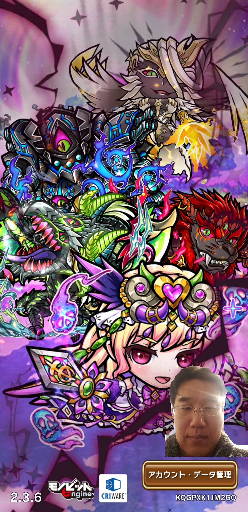
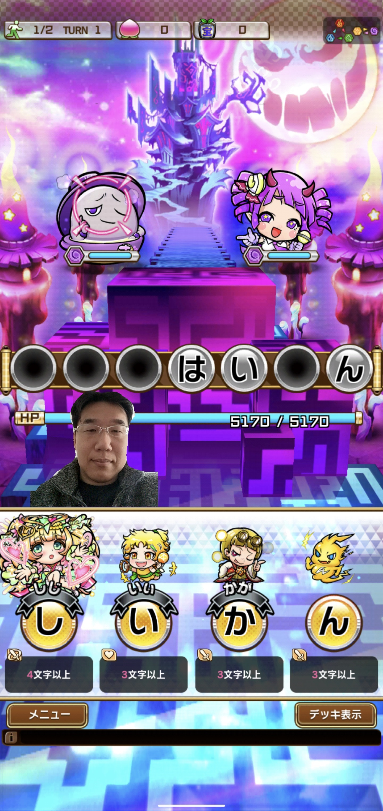

## AI Selfie サポートページ

AI Selfieを使うと、スマートフォンだけで簡単に顔出し実況中継ができます。このアプリを立ち上げてゲームをするだけ!!今までパソコンや機材が必要で手間や時間がかかった顔出しゲーム実況中継が簡単にできます。AIを使ってスマホのカメラに写った画像から人の顔部分を特定し抽出します。これからゲーム実況を考えている方や、すでに実況している方は是非トライしてみてください!!

### 顔出しすると差別化になる！！
ゲーム実況者はたくさんいますが、顔出しまでしているゲーム実況者は少ないので差別化ができます。

### 配信者のリアクションが伝わりやすい！！
表情や動きが見えるので配信者のリアクションが伝わりやすくなります。喜んだり驚いたりしているのが声だけと比べてわかりやすいので配信者の表情が見える分、感情が視聴者に届きやすいです。

### 視聴者との距離が近づく！！
顔出しをすることで配信者から視聴者に伝わる情報量が一気に増えます。実際に相手が目の前にいる状態に近づくことで、より身近に感じられるようになり、固定ファンがつきやすくなります。

## 使い方
アプリアイコンをタップして起動すると画面中央に自分の顔が表示されます。 
好きな位置にドラッグしてください。 
もう一度アプリアイコンをタップすると終了します。 
ステータスバーから終了することもできます。 

## 縦画面
<table border=0><tr><td>

</td><td>

</td></tr>
</table>

## 横画面

## ダウンロード
ダウンロードは[こちら Google Play](https://play.google.com/store/apps/details?id=live.aicast.selfie) 
https://play.google.com/store/apps/details?id=live.aicast.selfie

## 対象機種
Android 6以降

## お問い合わせ
ご意見・ご要望・ご質問は[こちらのgithub issues](https://github.com/aicast-live/selfie-support/issues)にお願いします。
