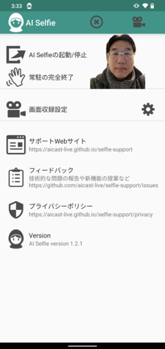

## AI Selfie サポートページ
 
コトダマン  

 
カラオケ  

 
Call of Duty: Mobile  

AI Selfieを使うと、スマホだけで簡単に顔出し実況中継ができます。このアプリを立ち上げてゲームをするだけ!!今までパソコンや機材が必要で手間や時間がかかった顔出しゲーム実況中継が簡単にできます。AIを使ってスマホのカメラに写った画像から人の顔部分を特定し抽出します。これからゲーム実況を考えている方や、すでに実況している方は是非トライしてみてください!!

### PC不要、スマホのみ！！
スマホのカメラを使ってあなたのプレイ中の顔を写します。AIが自動的に背景を除去します。
専用の撮影機材や配線、映像編集ソフトは不要です。

### 顔出しすると差別化になる！！
ゲーム実況者はたくさんいますが、顔出しまでしているゲーム実況者は少ないので差別化ができます。

### 配信者のリアクションが伝わりやすい！！
表情や動きが見えるので配信者のリアクションが伝わりやすくなります。喜んだり驚いたりしているのが声だけと比べてわかりやすいので配信者の表情が見える分、感情が視聴者に届きやすいです。

### 視聴者との距離が近づく！！
顔出しをすることで配信者から視聴者に伝わる情報量が一気に増えます。実際に相手が目の前にいる状態に近づくことで、より身近に感じられるようになり、固定ファンがつきやすくなります。

## 使い方
アプリを起動すると画面中央に自分の顔が表示されます。 
好きな位置にドラッグしてください。 
録画をしたいアプリを立ち上げ、右上の録画開始ボタンをクリック! 
録画終了ボタンを押すと録画が終了します。 
左上のバツボタンをタップするとカメラを終了します。 
ステータスバーから終了することもできます。 
録画履歴画面からYouTube/facebook/LINEにアップロードしてください 

## 縦画面例
  
コトダマン

## 横画面例
 
Call of Duty: Mobile

## 設定画面
    

## ダウンロード
ダウンロードは[こちら Google Play](https://play.google.com/store/apps/details?id=live.aicast.selfie) 
 
https://play.google.com/store/apps/details?id=live.aicast.selfie

## 対象機種
Android 6以降

## サポートWebサイト
<a href="https://aicast-live.github.io/selfie-support">https://aicast-live.github.io/selfie-support</a>

## お問い合わせ
技術的な問題の報告や新機能の提案など、
ご意見・ご要望・ご質問は[こちらのgithub issues](https://github.com/aicast-live/selfie-support/issues)にお願いします。

## プライバシーボリシー
<a href="https://aicast-live.github.io/selfie-support/privacy">https://aicast-live.github.io/selfie-support/privacy</a>
